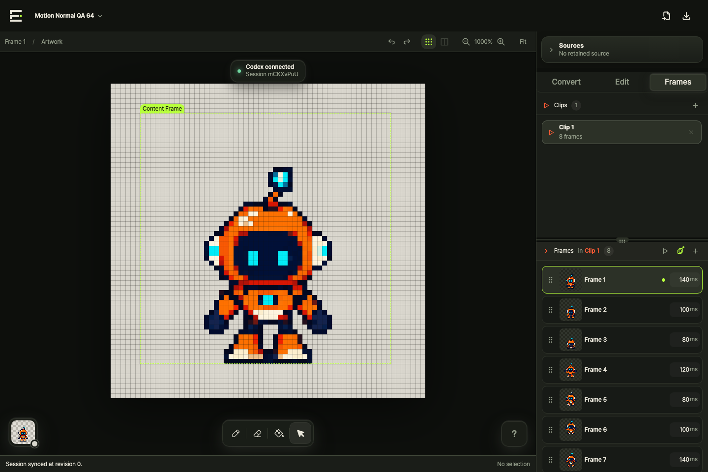

# Editable Pixel

[English](./README.md)

**AI가 만든 픽셀풍 이미지를 결정적이고 편집 가능한 실제 픽셀 에셋으로 바꿉니다. 모든 작업은 로컬에서 실행됩니다.**

Editable Pixel은 이미지, 짧은 애니메이션, Normal Map과 선택 영역에 제한된 Codex·Claude 편집을 위한 로컬 우선 픽셀 워크벤치입니다. CLI가 loopback 서버를 실행하고 브라우저에서 편집기를 열며, 원본 이미지와 Project, 편집 세션은 사용자의 기기에 남습니다.




## 설치

### 설치 스크립트 (macOS와 Linux)

[install.sh](./install.sh)를 확인한 뒤 실행합니다.

```bash
curl -fsSL https://raw.githubusercontent.com/NariP/editable-pixel/main/install.sh | sh
```

### npm

```bash
npm install --global editable-pixel
```

Node.js 20.9 이상이 필요합니다. 별도로 호스팅되는 Editable Pixel 웹 서비스는 사용하지 않습니다.

## 로컬 편집기 실행

원본이 없는 빈 Project를 엽니다.

```bash
editable-pixel open
```

기존 Project나 Pixel Document를 열 수도 있습니다.

```bash
editable-pixel open character.pixel-project.json
editable-pixel open character.pixel.json
```

명령을 실행하면 `127.0.0.1`에만 바인딩된 서버와 일회용 로컬 브라우저 세션이 열립니다. Header에서 PNG, WebP, JPEG, Pixel JSON, Pixel Project, 프레임 시퀀스 또는 Sprite Sheet를 바로 Import할 수 있습니다.

전역 설치 없이 최신 공개 패키지를 실행할 수도 있습니다.

```bash
npx editable-pixel open
```

## Codex와 Claude 연결

npm 패키지에는 Editable Pixel Skill과 MCP 실행 파일이 포함됩니다. 설치 후 두 호스트에 등록합니다.

```bash
editable-pixel install-skill --host both
```

한 호스트씩 설치할 수도 있습니다.

```bash
editable-pixel install-skill --host codex
editable-pixel install-skill --host claude
```

`install-skill`은 포함된 Skill을 복사하고 로컬 MCP의 절대 실행 경로를 등록합니다. 이후 Codex와 Claude는 현재 Project를 탐색하고, 기존 Selection 도구로 수정 대상을 화면에 표시하고, 픽셀·Palette·Layer·Frame·Clip·Normal Map·조명을 브라우저의 동일한 History에 바로 적용할 수 있습니다. 사용자와 AI 작업은 Undo, Redo, revision 검증과 자동 저장을 공유합니다.

전체 연결 방식은 [MCP와 호스트 설정](./docs/mcp.md)을 확인하세요.

## 기본 작업 흐름

```text
AI 이미지 또는 Sprite Gen 결과
          ↓
하나의 로컬 Project로 Import
          ↓
논리 픽셀 그리드로 Convert
          ↓
픽셀, Frames, Clips, Normal Map, 조명 편집
          ↓
Codex 또는 Claude로 정확한 영역 보정
          ↓
PNG, Lit PNG, GIF, Sprite Sheet, 편집 JSON Export
```

Editable Pixel은 생성된 에셋을 완성하고 보정하는 도구이며 AI Sprite Sheet 생성기를 포함하지 않습니다. `sprite-gen` 같은 생성기가 원본 프레임을 만들고, Editable Pixel이 결정적 변환, 정확한 픽셀 정리, 루프 연결, Normal Map, 조명과 Export를 담당합니다.

## 편집할 수 있는 것

- Pen, Eraser, Fill, Select, 잘라내기·복사·붙여넣기와 Palette 색상 교체
- Project마다 하나의 편집 캔버스와 비교·재변환을 위한 선택적인 원본 Sources
- Layers, Frames, 이름 있는 Clips, 프레임별 시간, 재생과 Onion Skin
- 공통 논리 캔버스에 Import한 프레임 시퀀스 정렬과 애니메이션 루프 연결 보정
- Layer와 Frame별 Color·Normal Map 편집
- Smooth 또는 Toon Palette 조명 미리보기와 조명이 구워진 Lit PNG
- 일시적인 로컬 재연결 중 편집 대기열 보존과 순차 반영
- Color PNG, Normal PNG, Lit PNG, GIF, Sprite Sheet, Pixel JSON, 전체 Project Export

## Project 모델

```text
Pixel Project (.pixel-project.json)
├── Sources (선택적인 원본 입력)
├── Pixel Document (.pixel.json 캔버스 교환 경계)
│   ├── Canvas + Palette
│   ├── Layers × Frames: Color + Normal 픽셀
│   └── Frames: duration + lighting
└── Clips: 정렬된 Frame ID
```

Project가 자동 저장되는 로컬 작업 단위입니다. `.pixel.json`은 편집 캔버스의 교환 포맷이고 PNG, GIF, Sprite Sheet는 파생 결과물입니다. Save As는 V2나 Variant가 아니라 독립 Project를 만듭니다.

## 자주 사용하는 CLI 명령

AI 이미지를 64×64 Pixel Document로 변환합니다.

```bash
editable-pixel convert robot.png --size 64 --colors 18 --output robot.pixel.json
```

Project를 만들고 엽니다.

```bash
editable-pixel project create "Robot Pack" --size 64 --output robot.pixel-project.json
editable-pixel open robot.pixel-project.json
```

검증, 렌더링과 내보내기를 실행합니다.

```bash
editable-pixel validate robot.pixel-project.json
editable-pixel render robot.pixel-project.json --format lit --scale 4 --output robot-lit.png
editable-pixel export robot.pixel-project.json --output robot-export
```

전체 명령과 안정적인 JSON 출력은 [CLI 레퍼런스](./docs/cli.md)를 확인하세요.

## 업데이트와 제거

설치 스크립트를 다시 실행하면 최신 npm 릴리스로 업데이트됩니다.

```bash
curl -fsSL https://raw.githubusercontent.com/NariP/editable-pixel/main/install.sh | sh
```

특정 버전을 설치하거나 제거할 수도 있습니다.

```bash
sh install.sh --version 1.0.0
sh install.sh --uninstall
```

같은 npm 명령은 다음과 같습니다.

```bash
npm update --global editable-pixel
npm uninstall --global editable-pixel
```

npm 패키지를 제거해도 사용자가 Export한 파일이나 브라우저에 로컬 저장된 Project는 삭제되지 않습니다.

## 소스에서 빌드

```bash
git clone https://github.com/NariP/editable-pixel.git
cd editable-pixel
corepack enable
pnpm install --frozen-lockfile
pnpm build
node packages/pixel-cli/dist/cli.js open
```

## 문서

- [시작하기](./docs/getting-started.md)
- [Project 모델](./docs/project-model.md)
- [Pixel Document v1](./docs/pixel-document.md)
- [CLI 레퍼런스](./docs/cli.md)
- [MCP와 호스트 연결](./docs/mcp.md)
- [보안 모델](./docs/security.md)
- [릴리스 절차](./docs/releases.md)
- [검증 기록](./docs/validation.md)
- [기여 가이드](./CONTRIBUTING.md)

## 개발

```bash
pnpm verify
pnpm test:e2e
pnpm test:distribution
pnpm test:source-install
```

## 라이선스

[MIT](./LICENSE)
