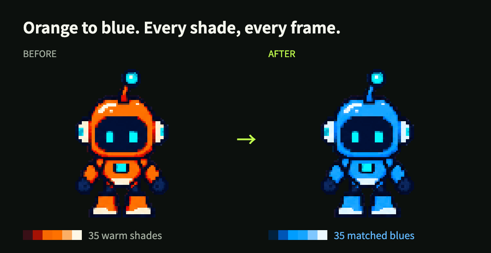
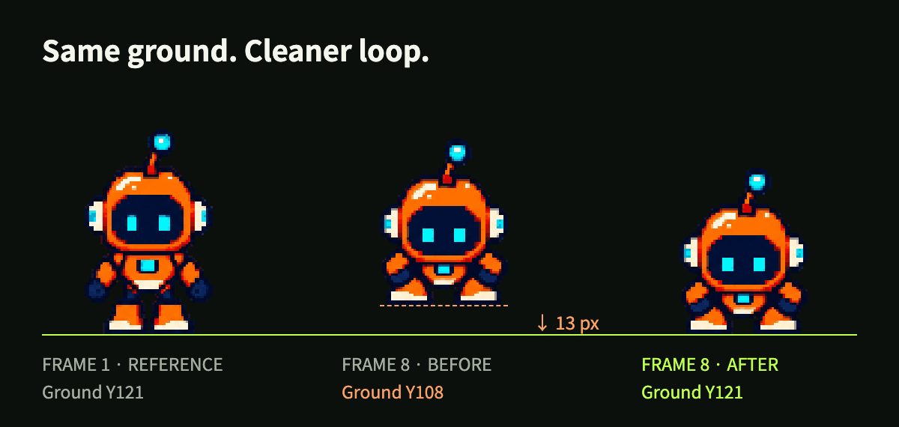
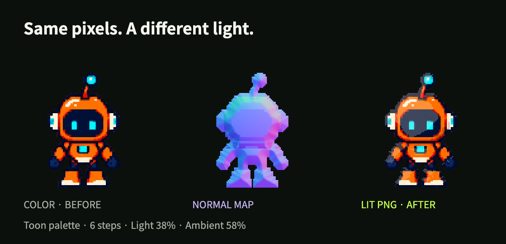
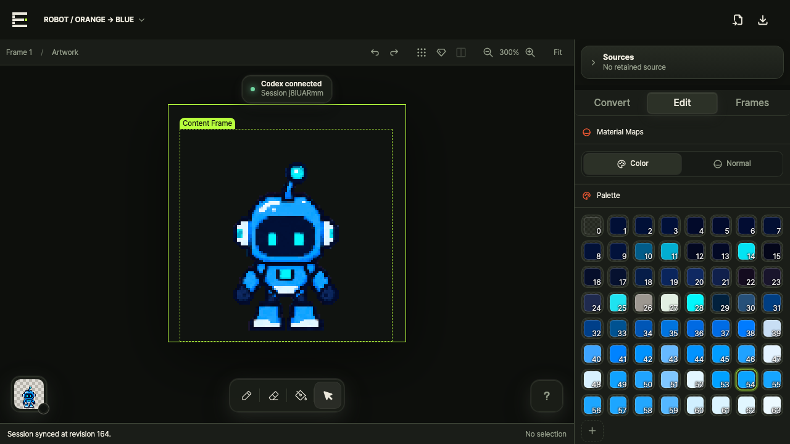

# Editable Pixel

[English](./README.md) · [비포·애프터](#before-and-after) · [로컬 실행](#로컬-실행) · [AI 연결](#connect-ai)

**마음에 드는 스프라이트는 그대로, 고치고 싶은 부분은 말로.**

AI로 이미지 에셋을 만드는 사람을 위한 로컬 픽셀 편집기입니다. 생성한 이미지나 스프라이트 시트를 실제 픽셀 그리드로 변환하고, 브라우저에서 직접 편집하거나 **Codex·Claude에 말해 같은 캔버스를 MCP로 수정**할 수 있습니다.

캐릭터를 다시 그리지 않고 색상을 바꾸고, 애니메이션 위치를 맞추고, 특정 픽셀과 노멀맵을 손본 뒤 결과물을 내보내세요.

<a id="before-and-after"></a>

## 비포·애프터

아래는 **128×128, 8프레임** 로봇 예제의 실제 Editable Pixel 출력입니다. 전후 이미지는 같은 정수 배율로 표시했으며, 캐릭터를 다시 생성하지 않았습니다.

### 한 색만 바꾸는 게 아니라, 명암까지 함께

> “8프레임 전체의 주황색 로봇을 파란색으로 바꿔줘. 명암과 청록색 포인트는 유지해.”



단색 하나로 덮지 않고 **따뜻한 계열의 팔레트 35색**을 각각 대응하는 파란 계열로 바꿨습니다. 청록색 포인트 색상, 어두운 바이저 픽셀, 실루엣과 프레임별 포즈는 유지합니다.

### 첫·마지막 프레임의 바닥 위치 맞추기

> “마지막 프레임을 아래로 내려서 첫 프레임과 바닥 위치를 맞춰줘.”



예제를 위해 위치를 어긋나게 둔 프레임을 **13픽셀** 이동했습니다. 포즈는 그대로 두고 위치만 보정합니다. 바닥 정렬은 루프를 다듬는 작업 중 하나이며, 서로 다른 포즈까지 같게 만드는 기능은 아닙니다.

### 색상 레이어를 다시 칠하지 않고 조명 적용

> “노멀맵에 동일한 6단계 조명을 적용하고 Lit PNG로 내보내줘.”



이 예제는 **프레임별로 준비한 노멀맵**과 Toon Palette 6단계, 조명 강도 38%, 주변광 58%를 사용합니다. Color·Normal·Lit은 별도로 내보낼 수 있습니다. 이미지를 가져오기만 하면 노멀맵이 자동 생성된다는 뜻은 아닙니다.

[예제 제작·검증 내용](./docs/media/README.md)

## 사용자와 AI가 함께 쓰는 하나의 편집기



- **수정 대상이 보입니다.** AI가 잡은 영역도 마우스로 선택할 때와 같은 Selection 도구로 표시됩니다.
- **히스토리를 공유합니다.** 사용자와 AI의 편집이 같은 History, Undo, Redo, revision 검증과 자동 저장을 사용합니다.
- **픽셀 단위로 지정합니다.** 좌표, 사각형, 마스크, 연결 영역, 팔레트 색, Layer, Frame, Clip을 대상으로 수정할 수 있습니다.
- **MCP로 직접 편집합니다.** 필요한 맥락을 읽고 구조화된 편집 명령을 적용하므로, 픽셀마다 마우스 클릭을 흉내 낼 필요가 없습니다.

이렇게 요청할 수 있습니다.

```text
선택한 픽셀을 오른쪽으로 2px 옮겨줘.
외곽선 밖에 남은 흰 픽셀만 지워줘. 내부는 건드리지 마.
이 애니메이션 전체의 주황색 명암 팔레트를 파란 계열로 바꿔줘.
Frame 1은 160ms, Frame 4는 100ms로 설정해줘.
```

## 로컬 실행

**배포 준비 단계입니다.** npm 패키지는 아직 공개되지 않았으므로 아래 소스 빌드를 사용하세요. npm·install.sh 배포 경로는 준비되어 있지만 아직 설치 가능한 공개 릴리스는 아닙니다.

**Node.js 20.9 이상**, **pnpm 10.29.3**이 필요합니다. 별도 웹 서비스에 접속하는 방식이 아니라 내 컴퓨터에서 편집기를 실행합니다.

```bash
git clone https://github.com/NariP/editable-pixel.git
cd editable-pixel
corepack enable
pnpm install --frozen-lockfile
pnpm build
node packages/pixel-cli/dist/cli.js open
```

서버는 `127.0.0.1`에서 실행됩니다. 빈 Project로 시작하거나 기존 파일을 열 수 있습니다.

```bash
node packages/pixel-cli/dist/cli.js open character.pixel-project.json
node packages/pixel-cli/dist/cli.js open character.pixel.json
```

<details>
<summary>npm 배포 이후: 설치·업데이트·제거</summary>

```bash
npm install --global editable-pixel
editable-pixel open
```

macOS·Linux에서는 [install.sh](./install.sh)를 확인한 뒤 아래 명령을 사용할 수도 있습니다.

```bash
curl -fsSL https://raw.githubusercontent.com/NariP/editable-pixel/main/install.sh | sh
```

이 스크립트도 npm 패키지를 설치하므로 공개 릴리스가 먼저 필요합니다. 다시 실행하면 업데이트되며, `sh install.sh --version X.Y.Z`로 버전을 지정할 수 있습니다.

```bash
npm update --global editable-pixel
npm uninstall --global editable-pixel
```

패키지를 제거해도 내보낸 파일이나 브라우저에 로컬 저장된 Project는 삭제되지 않습니다.

</details>

<a id="connect-ai"></a>

## Codex·Claude 연결

빌드한 저장소에서 실행합니다.

```bash
node packages/pixel-cli/dist/cli.js install-skill --host both
```

한쪽만 연결하려면 `--host codex` 또는 `--host claude`를 사용하세요. 포함된 **Skill**을 설치하고 로컬 **MCP 서버**를 등록합니다. 호스트를 다시 시작하거나 MCP 연결을 새로 고친 뒤 Project를 열고 편집해 달라고 요청하세요. MCP가 해당 경로의 실행 파일을 참조하므로 설치 후 저장소 폴더를 유지해야 합니다.

Skill은 메타데이터부터 읽고, 필요한 영역만 확인한 뒤, 사용자가 보고 있는 같은 Project에 편집을 적용하도록 안내합니다. 자세한 내용은 [호스트 설정과 MCP 도구](./docs/mcp.md)를 확인하세요.

Editable Pixel의 편집기·변환·렌더링은 로컬에서 실행됩니다. 다만 Codex·Claude에 전달하는 맥락은 해당 호스트의 모델·개인정보 설정을 따릅니다. 로컬 편집기라고 해서 클라우드 AI까지 오프라인으로 동작하는 것은 아닙니다.

## 가져오기 → 편집 → 내보내기

1. **가져오기:** PNG, WebP, JPEG, Pixel JSON, Project, 프레임 시퀀스, 스프라이트 시트를 지원합니다. 캔버스 교체·Frames 추가·Source 보관 중 목적을 선택합니다.
2. **변환:** 보관한 원본 이미지의 캔버스 크기, 팔레트, 배경, 정렬과 디더링을 설정해 논리 픽셀 그리드로 변환합니다.
3. **편집:** 픽셀과 Layers를 수정하고, Frames를 Clips로 묶고, 프레임 시간·재생·Onion Skin을 조절합니다. Color·Normal 편집과 Smooth·Toon Palette 조명을 사용할 수 있습니다.
4. **내보내기:** Color PNG, Normal PNG, 조명이 적용된 Lit PNG, GIF, Sprite Sheet, 편집용 Pixel JSON, 전체 Project를 지원합니다. 정수 배율로 픽셀 경계를 선명하게 유지합니다.

**실험 기능:** 2:1 아이소메트릭 가이드와 AI의 다이아몬드 타일 선택은 기본 작업 흐름과 별도로 개발 중입니다.

## 무엇이 저장되나요?

| 포맷 | 역할 |
| --- | --- |
| `.pixel-project.json` | 하나의 편집 캔버스, Layers, Frames, Clips와 선택적인 원본 Sources를 포함하는 전체 Project |
| `.pixel.json` | 팔레트, 픽셀, 프레임 시간, 노멀맵과 조명을 담는 편집용 Pixel Document |
| PNG / GIF / Sprite Sheet | 게임·미리보기·다른 도구에서 사용할 출력 결과물 |

편집은 로컬 작업 공간에 자동 저장됩니다. **Save As**는 V1/V2 버전이 아니라 독립된 새 Project를 만듭니다. 이동 가능한 백업이 필요하면 Project 파일을 내보내세요.

원본 Source가 없어도 그리기와 편집은 가능합니다. 다만 원본 기반 재변환이나 Content Frame 정규화가 필요하다면 이미지 Source를 보관하세요. Pixel JSON 자체가 원본 이미지는 아닙니다. 자세한 내용은 [Project 모델](./docs/project-model.md)을 참고하세요.

Editable Pixel에는 **이미지 생성 모델이나 스프라이트 시트 생성기가 포함되어 있지 않습니다.** 원하는 생성기로 만든 결과를 가져와 변환·정밀 보정·애니메이션 정리·내보내기를 진행하는 도구입니다.

## 문서와 개발

- [시작하기](./docs/getting-started.md)
- [CLI 레퍼런스](./docs/cli.md) · [MCP와 호스트 연결](./docs/mcp.md)
- [Project 모델](./docs/project-model.md) · [Pixel Document 포맷](./docs/pixel-document.md)
- [보안 모델](./docs/security.md) · [취약점 제보](./SECURITY.md)
- [기여 가이드](./CONTRIBUTING.md) · [릴리스 절차](./docs/releases.md) · [검증 기록](./docs/validation.md)

```bash
pnpm dev                  # 웹 개발 서버
pnpm verify               # 빌드·린트·타입 검사·단위/통합 테스트
pnpm test:e2e             # 브라우저 작업 흐름
pnpm test:distribution    # 패키지 설치 검증
pnpm test:source-install  # 깨끗한 소스 체크아웃 설치 검증
```

## 라이선스

[MIT](./LICENSE)
